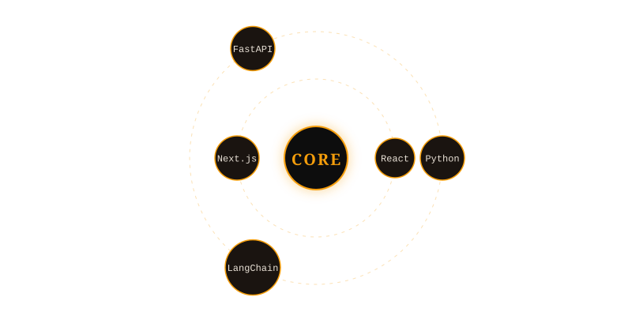

 

&nbsp;

&nbsp;

 

&nbsp;

&nbsp;

 

---

Second-year B.Tech CS undergrad at VIT Chennai. I build full-stack systems and production-grade tools — ML backends that validate their own answers, civic and student platforms with real-time features, and zero-dependency React performance hooks. Strong foundation in DSA, algorithms, and scalable software design.

Web Developer and Student Ambassador at Bionary Club, CodeChef VITCC, and PhysicsWallah. Competing in hackathons, leading campus initiatives, and collaborating on projects that ship.

---

 

**★ Featured**

<table width="100%">
<tr>
<td width="50%" valign="top">

**[TheSuperRAG](https://github.com/tanushbhootra576)** &nbsp; 

Self-healing RAG backend that validates its own context, re-queries when confidence fails, and streams citations inline. Built for production correctness — not demo accuracy.

`Python` `LangGraph` `LangChain` `Qdrant` `FastAPI`

</td>
<td width="50%" valign="top">

**[Epistemic Protocol](https://github.com/tanushbhootra576)** &nbsp; 

VS Code extension that detects AI-generated code in real time via keystroke biometrics — developer security at the input level, before the commit.

`TypeScript` `Python` `VS Code API` `ML`

</td>
</tr>
</table>

 

---

 

**Projects**

| Project | What it does | Stack | Status |
|---|---|---|:---:|
| [use-web-kit](https://github.com/tanushbhootra576) | Zero-dependency React 19 hooks — RAF-batched, SSR-exact, 60fps by design | `TypeScript` `React 19` | 🟢 Stable |
| [Campus Connect](https://github.com/tanushbhootra576) | Student platform — real-time chat, discussion forums, project showcases | `React` `Node.js` `MongoDB` | 🔵 Complete |
| [Civic Issue Reporting](https://github.com/tanushbhootra576) | Civic issue reporting with live maps — community-driven quick action | `React` `Node.js` `Maps API` | 🔵 Complete |
| [GridSaga](https://github.com/tanushbhootra576) | 2048 on a Rubik's Cube — geometry as game mechanic | `Next.js` `TypeScript` | 🔵 Complete |
| [Portfolio](https://tanushportfolio.vercel.app/) | Interactive personal portfolio — 3D interactions, responsive, creative UX | `Next.js` `Three.js` | 🟢 Live |

 

---

 

**Stack**

<table width="100%">
<tr>
<td width="50%" valign="top">

**Languages**

 

**AI / ML**

</td>
<td width="50%" valign="top">

**Frontend & Backend**

 

**Databases & Infra**

</td>
</tr>
</table>

 

---

 

**Recognition**

3rd Place — TetherX 2024 &nbsp;·&nbsp; CodeChef VITCC × Unstop &nbsp;·&nbsp; 2,200+ participants &nbsp;·&nbsp; 80+ teams &nbsp;·&nbsp; 24 hours

 

---

 

  

<table>
<tr>
<td align="center">

</td>
<td align="center">

</td>
<td align="center">

</td>
</tr>
</table>

 

  

<picture>
  <source media="(prefers-color-scheme: dark)"  srcset="https://raw.githubusercontent.com/tanushbhootra576/tanushbhootra576/output/github-snake-dark.svg"/>
  <source media="(prefers-color-scheme: light)" srcset="https://raw.githubusercontent.com/tanushbhootra576/tanushbhootra576/output/github-snake.svg"/>
  
</picture>

  

 

---

 

 

---

 

&nbsp;⏱&nbsp; Wakatime — Weekly Coding Stats

 

<!--START_SECTION:waka-->
<!--END_SECTION:waka-->

> **Setup:** Install [WakaTime](https://wakatime.com) in VS Code → add `WAKATIME_API_KEY` + `GH_TOKEN` as repo secrets → workflow runs daily.

&nbsp;📌&nbsp; Currently Learning

 

- Advanced LangGraph multi-agent orchestration patterns
- Distributed systems — consensus algorithms (Raft)
- Systems design for production ML inference

